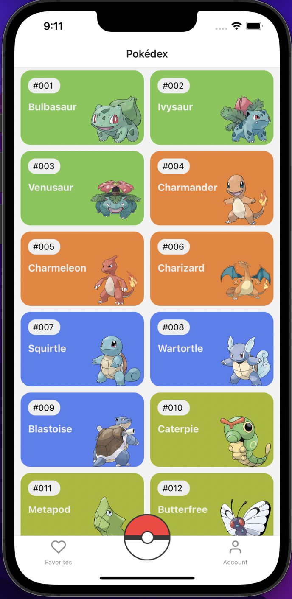
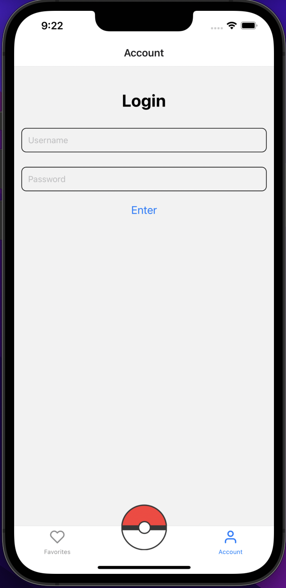
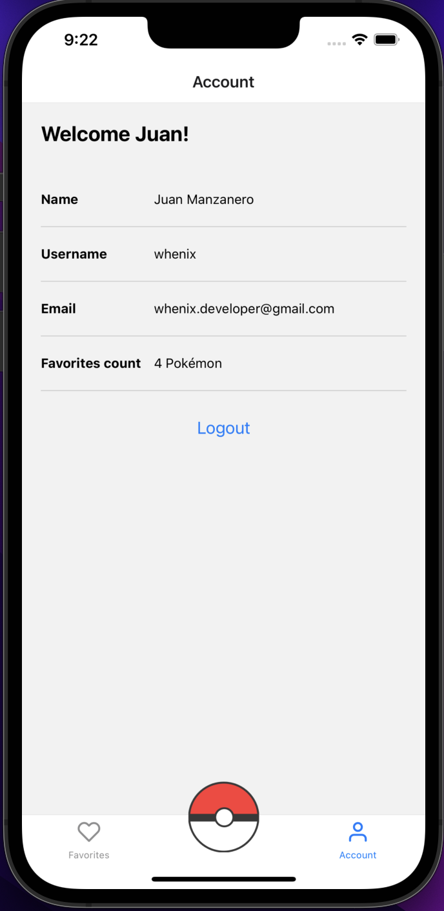
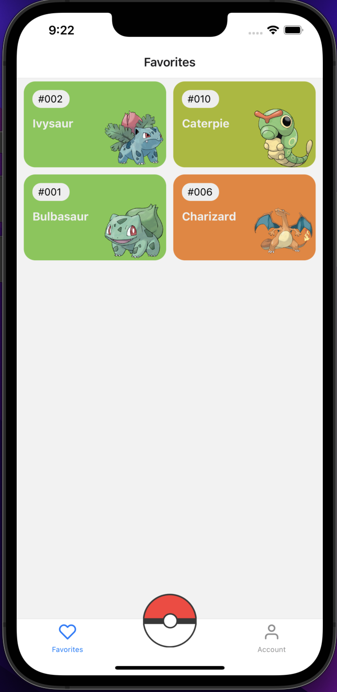
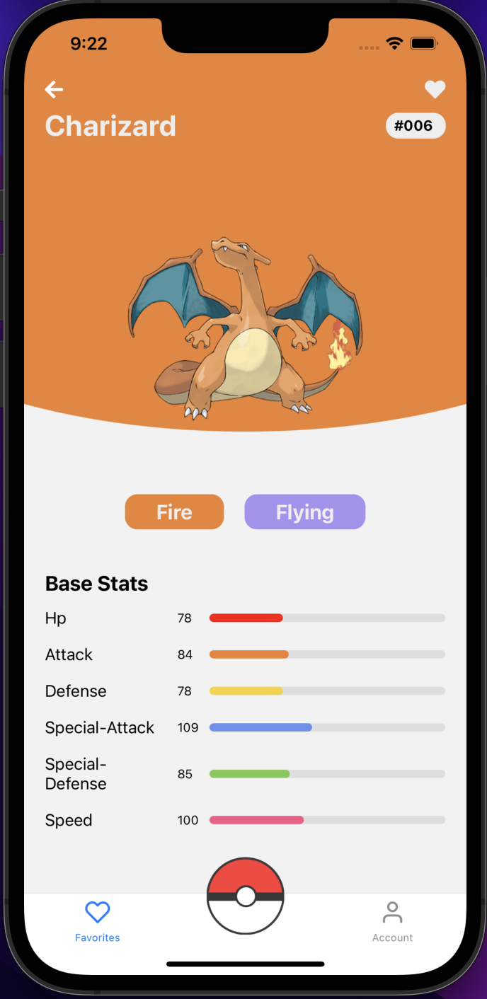

# PokéNative 📱

### A Pokédex developed with React Native.

## Project images examples

<div styles='display: flex'>



</div>

<div styles='display: flex'>



</div>

<div styles='display: flex'>

</div>

## 📚 Things that I've learned with this project

- ⚛️📱 React Native fundamentals, like:
    ````javascript
        <View />
        <Text />
    ````